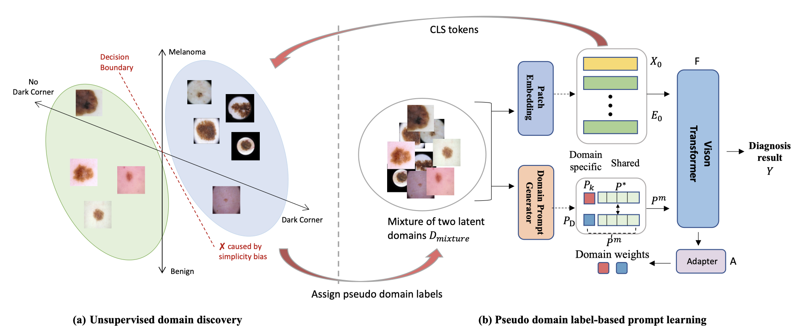

# PLDG
This repo is the official implementation of the TMI2024 paper "Prompt-driven Latent Domain Generalization for Medical Image Classification".

WARNING: This repo is still under construction, welcome to raise an issue if you run into any bugs.

## Introduction
**[abstract]** *Deep learning models for medical image analysis easily suffer from distribution shifts caused by dataset
artifacts bias, camera variations, differences in the imaging station, etc., leading to unreliable diagnoses in realworld clinical settings. Domain generalization (DG) methods, which aim to train models on multiple domains to perform well on unseen domains, offer a promising direction to
solve the problem. However, existing DG methods assume
domain labels of each image are available and accurate,
which is typically feasible for only a limited number of
medical datasets. To address these challenges, we propose
a novel DG framework for medical image classification
without relying on domain labels, called Prompt-driven
Latent Domain Generalization (PLDG). PLDG consists of
unsupervised domain discovery and prompt learning. This
framework first discovers pseudo domain labels by clustering the bias-associated style features, then leverages collaborative domain prompts to guide a Vision Transformer
to learn knowledge from discovered diverse domains. To
facilitate cross-domain knowledge learning between different prompts, we introduce a domain prompt generator that
enables knowledge sharing between domain prompts and
a shared prompt. A domain mixup strategy is additionally
employed for more flexible decision margins and mitigates
the risk of incorrect domain assignments. Extensive experiments on three medical image classification tasks and one
debiasing task demonstrate that our method can achieve
comparable or even superior performance than conventional DG algorithms without relying on domain labels.*



## Installation
Create the environment and install packages
```
conda create -n env_name python=3.8 -y
conda activate env_name
pip install -r requirements.txt
```

## Preparing datasets

**Skin Datasets**: please refer to the repo of our previous [work](https://github.com/SiyuanYan1/EPVT-and-Skin-DG-benchamrk).

**Camelyon17 Benchmark**: download the dataset from [here](https://pubmed.ncbi.nlm.nih.gov/30716025/)

**APTOS (DR) Datasets**: download the dataset from [here](https://www.kaggle.com/competitions/aptos2019-blindness-detection/data?select=train_images)

**EyePACS (DR) Datasets**: download the dataset from [here](https://www.kaggle.com/competitions/diabetic-retinopathy-detection/overview)

**Messidor-1 (DR) Datasets**: download the dataset from [here](https://www.adcis.net/en/third-party/messidor/)

**Messidor-2 (DR) Datasets**: download the dataset from [here](https://www.adcis.net/en/third-party/messidor2/)


Put each dataset in a folder under the `PLDG/domainbed/data` directory as follows:

```
data
├── ISIC2019_train
│   ├── clean
│   │   ├──ben
│   │   ├──mel
│   ├── dark_corner
│   ├── gel_bubble
│   ├── ...

├── DG_DR_Classification
│   ├──aptos2019-blindness-detection
│   │   ├──0
│   │   ├──1
│   │   ├──2
│   │   ├──3
│   │   ├──3
│   ├──EyePACS
│   │   ├──...
│   ├──Messidor-1
│   │   ├──...
│   ├──Messidor-2
│   │   ├──...

├── camelyon17_v1.0
```


## Training

Our benchmark is modified based on DomainBed, please refer to [DomainBed Readme](https://github.com/facebookresearch/DomainBed) for more details on commands running jobs. Here are some examples to train and test on the three medical datasets.

Training PLDG on skin classification:
```
CUDA_VISIBLE_DEVICES=0 python -m domainbed.scripts.train_latent_epvt --data_dir=./domainbed/data/ --steps 5900 --dataset DG_Dataset --test_env 0 --algorithm Latent_EPVT --output_dir \
results/exp --hparams '{"lr": 5e-6, "lr_classifier": 5e-5,"batch_size":130,"wd_classifier": 1e-2, "prompt_dim":4}' --exp 'epvt_5e-6-5e-5_p4' --clustering True \
 --use_domain_labels False --loss-disc-weight --num-clustering 4``
```

Test PLDG on four OOD skin datasets with pompt=10
```
CUDA_VISIBLE_DEVICES=0 python -m domainbed.scripts.test_prompt10 --model_name 'model_name.pkl'
```

Test PLDG on four OOD skin datasets with pompt=4
```
CUDA_VISIBLE_DEVICES=0 python -m domainbed.scripts.test_prompt --model_name 'model_name.pkl'
```

Training PLDG on three out of four DR classification datasets and testing on the remaining one
```
CUDA_VISIBLE_DEVICES=1 python -m domainbed.scripts.train_dr_latent --data_dir=./domainbed/data/ --steps 1000 --dataset Latent_DR_Dataset --test_envs 0 --val_envs 1 \
--algorithm Latent_EPVT --output_dir results/exp --hparams '{"lr":5e-6, "lr_classifier": 5e-5,"batch_size":130,"wd_classifier":1e-5,"prompt_dim":10,"seed":1}' --exp 'latent_dr_eyepacs_p10' --clustering True
 CUDA_VISIBLE_DEVICES=1 python -m domainbed.scripts.train_dr_latent --data_dir=./domainbed/data/ --steps 5697 --dataset Latent_DR_Dataset --test_envs 2 --val_envs 1 \
--algorithm Latent_EPVT --output_dir results/exp --hparams '{"lr":5e-6, "lr_classifier": 5e-5,"batch_size":130,"wd_classifier":1e-5}' --exp 'latent_dr_m2' --clustering True 
CUDA_VISIBLE_DEVICES=1 python -m domainbed.scripts.train_dr_latent --data_dir=./domainbed/data/ --steps 5697 --dataset Latent_DR_Dataset --test_envs 3 --val_envs 1 \
--algorithm Latent_EPVT --output_dir results/exp --hparams '{"lr":5e-7, "lr_classifier": 5e-6,"batch_size":130,"wd_classifier":1e-5}' --exp 'latent_dr_aptos_5e-7' --clustering True
```
Training PLDG on Camelyon17-wilds dataset
```
CUDA_VISIBLE_DEVICES=1 python -m domainbed.scripts.train_cam17 --data_dir=./domainbed/data/ --steps 5900 --dataset DG_Dataset --test_env 0 --algorithm Latent_EPVT --output_dir \
results/exp --hparams '{"lr": 5e-7, "lr_classifier": 5e-7,"batch_size":130,"wd_classifier": 1e-4, "prompt_dim":4}' --exp 'epvt_5e-7_5e-7_1e-4_sne_exp' --clustering True \
 --use_domain_labels False --loss-disc-weight --num-clustering 4
```


## Citation

```bibtex
@inproceedings{yan2023epvt,
  title={EPVT: Environment-Aware Prompt Vision Transformer for Domain Generalization in Skin Lesion Recognition},
  author={Yan, Siyuan and Liu, Chi and Yu, Zhen and Ju, Lie and Mahapatra, Dwarikanath and Mar, Victoria and Janda, Monika and Soyer, Peter and Ge, Zongyuan},
  booktitle={International Conference on Medical Image Computing and Computer-Assisted Intervention},
  pages={249--259},
  year={2023},
  organization={Springer}
}
```

## Acknowlegdement

This code is built on [DomainBed](https://github.com/facebookresearch/DomainBed), [DoPrompt](https://github.com/zhengzangw/DoPrompt), [EPVT](https://github.com/SiyuanYan1/EPVT-and-Skin-DG-benchamrk), and [dg_mmld](https://github.com/mil-tokyo/dg_mmld). We thank the authors for sharing their codes.

